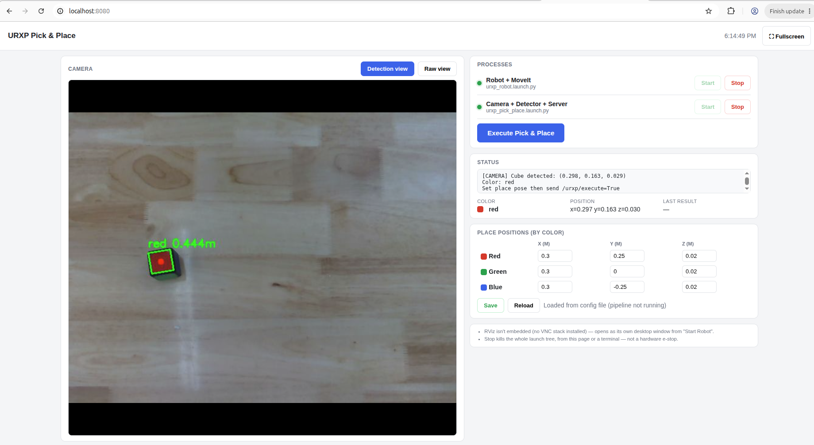
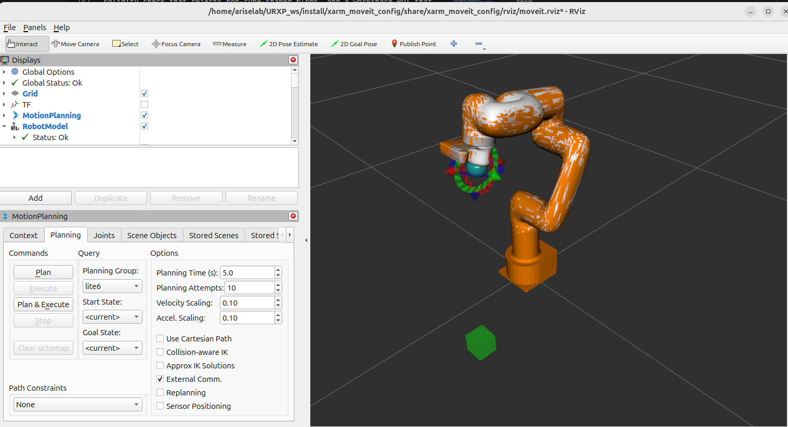
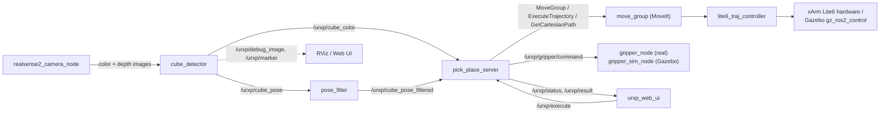
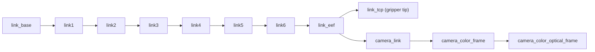

# UFactory Lite6 Cube Pick & Place

A ROS 2 (Jazzy) system that picks up a 3-colored cube using an eye-in-hand
RealSense camera and a UFACTORY xArm Lite6 with a vacuum gripper, and sorts
it into one of three positions by color. Runs on real hardware or in Gazebo
simulation, with an optional local web dashboard as a third way to run it.


| Web UI (`urxp_web_ui`) | RViz (real-hardware run) |
|---|---|
|  |  |

<!-- TODO: image — robot_setup.jpg: wide shot of the physical cell -->

---

## Part 1 — Getting Started

### Hardware

- UFACTORY xArm **Lite6**, with the standard vacuum gripper (Tool GPIO controlled)
- Intel RealSense **D435i**, wrist-mounted per UFACTORY's standard mount
- A 5cm cube with 3 colors across its 6 faces (opposite-face pairs share a color —
  default mapping: red top/bottom, green front/back, blue left/right)
- A table / flat work surface in front of the robot

### Software

- Ubuntu 24.04, **ROS 2 Jazzy**
- `colcon`, standard ROS 2 build tools
- For simulation: Gazebo **Harmonic** (`gz-sim8`) + `ros-jazzy-ros-gz-sim`, `ros-jazzy-ros-gz-bridge`, `ros-jazzy-gz-ros2-control`
- For real hardware: `ros-jazzy-realsense2-camera`, and the `xarm-python-sdk` Python package
- No extra Python packages for the web UI — it's built on the standard library only

```bash
sudo apt install ros-jazzy-realsense2-camera ros-jazzy-ros-gz-sim \
    ros-jazzy-ros-gz-bridge ros-jazzy-gz-ros2-control
pip install --user xarm-python-sdk
```

### Install & Build

```bash
git clone https://github.com/ARISELABNMT/ufactory_lite_cube_pick_place.git
cd ufactory_lite_cube_pick_place
source /opt/ros/jazzy/setup.bash
colcon build --symlink-install
```

> This repo vendors UFACTORY's `xarm_ros2` driver/MoveIt stack directly under
> `src/xarm_ros2` (with a couple of local patches — see [Part 2](#third-party-code)),
> so this one `colcon build` is all you need — no extra clones or submodules.

### Run it

**Option A — Real hardware** (two terminals):

```bash
# Terminal 1: robot driver + MoveIt + RViz
source install/setup.bash
ros2 launch urxp_pick_place urxp_robot.launch.py robot_ip:=192.168.1.165

# Terminal 2: camera + detector + gripper + pick-place server
source install/setup.bash
ros2 launch urxp_pick_place urxp_pick_place.launch.py
```

Then trigger a pick-and-place once the cube is on the table:

```bash
ros2 topic pub --once /urxp/execute std_msgs/msg/Bool "{data: true}"
```

**Option B — Gazebo simulation** (one terminal, no hardware needed):

```bash
source install/setup.bash
ros2 launch urxp_pick_place urxp_gazebo.launch.py
```

**Option C — Web dashboard** (start/stop buttons, live camera view, no terminal juggling):

```bash
./src/urxp_web_ui/run_web_ui.sh
# open http://localhost:8080
```

Where the cube ends up is set per color in
[`config/pick_place_params.yaml`](src/urxp_pick_place/config/pick_place_params.yaml)
(`place_position_red/green/blue`) — editable there directly, or live from the web UI.

---

## Part 2 — Project Structure & How It Works

### Repository layout

```
├── src/
│   ├── urxp_pick_place/   # detection, motion planning, gripper control — the core package
│   ├── urxp_web_ui/       # local web dashboard (Python stdlib http server + rclpy)
│   └── xarm_ros2/         # vendored UFACTORY driver, MoveIt config, robot description
├── docs/images/           # screenshots referenced from this README
└── README.md
```

### Packages

| Package | Role |
|---|---|
| `urxp_pick_place` | Everything specific to this task: color/pose detection, the pick-place state machine, gripper drivers (real + simulated), launch files |
| `urxp_web_ui` | Optional dashboard: start/stop the launches above, live camera stream, status, color→position editor |
| `xarm_ros2` | UFACTORY's robot description (URDF/xacro), `ros2_control` hardware interface, MoveIt config, and Gazebo integration — used as-is, aside from the patches noted [below](#third-party-code) |

### Node graph



`pick_place_server` is the state machine at the center of it all: it picks the
cube from a manually-published pose or the latest camera detection, plans
each motion segment through MoveIt (approach → descend → grasp → lift →
place → release), and manages the picked cube as a MoveIt planning-scene
collision object (added when detected, attached to the gripper on grasp,
detached on release) so it's represented correctly for collision checking
throughout.

### Camera → robot frame

The camera is wrist-mounted, so its frame moves with the arm. The full chain
is one continuous TF tree, published by `robot_state_publisher` from the
URDF plus live joint states — no manual bookkeeping needed:



`cube_detector` deprojects a detected pixel + depth reading into a 3D point
in `camera_color_optical_frame`, then calls `tf2_ros.Buffer.transform(...)`
once to land it in `link_base` — `tf2` walks the whole chain above
automatically, using whatever the arm's current joint angles are at that
instant. The `link_eef → camera_link` offset comes from the D435i mount's
CAD geometry baked into the URDF (`xarm_description`'s
`realsense_d435i.urdf.xacro`), not a runtime hand-eye calibration — accurate
enough for this task, but a natural upgrade path (e.g. `easy_handeye2`) if
you need tighter accuracy.

### Grasping accuracy

Three things work together to make the grasp land well, not just "close enough":

1. **Stable input** — `pose_filter` only forwards a detection once the last
   *N* raw samples agree within a tight threshold (sliding-window median),
   so the arm never commits to a pose while the detector is still jittering.
2. **Orientation-aware grasp** — `cube_detector` reports the cube's in-plane
   rotation (`cv2.minAreaRect`, folded to ±45° by the cube's own symmetry);
   `pick_place_server` builds a grasp orientation that combines pointing
   straight down with that yaw, so the gripper lines up with the cube's
   edges instead of always approaching at a fixed angle.
3. **Calibrated offsets** — `grasp_height_offset` accounts for the vacuum
   cup's physical length below `link_eef`, so the descent stops exactly at
   the cube's surface rather than at the flange.

Detection quality itself — separating the cube from the table/background
reliably — comes down to HSV color ranges tuned against real captures, a
solidity check that rejects non-cube-shaped blobs, and a workspace ROI that
excludes background clutter; all tunable in
[`config/detector_params.yaml`](src/urxp_pick_place/config/detector_params.yaml).

### Third-Party Code

`src/xarm_ros2` is UFACTORY's [xarm_ros2](https://github.com/xArm-Developer/xarm_ros2)
(BSD-3-Clause, see `src/xarm_ros2/LICENSE`), vendored directly rather than as
a submodule so the repo is self-contained. Two local changes on top of
upstream:
- `xarm_controller/config/lite6_controllers.yaml` — relaxed trajectory/goal
  tolerances for smoother real-hardware execution
- `xarm_description/urdf/vacuum_gripper/lite_vacuum_gripper.urdf.xacro` —
  added a Gazebo `DetachableJoint` plugin so the simulated vacuum gripper can
  physically pick up and carry the cube in Gazebo, not just in the planning scene

---

## License

Original code (`urxp_pick_place`, `urxp_web_ui`) is MIT-licensed — see
[LICENSE](LICENSE). `xarm_ros2` keeps its own BSD-3-Clause license.
